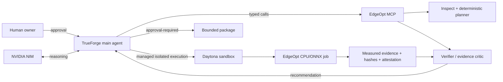

# EdgeOpt

EdgeOpt helps an agent turn a trained model into a measured, evidence-backed
edge deployment candidate, then stops for human approval before packaging.

## The problem

Having a trained model is only the beginning. Deployment must satisfy a target
hardware profile, application inputs, quality requirements, latency goals, and
resource limits at the same time. The fastest-looking optimization may be
incompatible with the device, fail the quality rule, or be impossible to
reproduce. EdgeOpt makes those constraints explicit and checks candidates with
real execution evidence.

## What EdgeOpt does

The bounded workflow is:

`DeploymentContract → inspect → measure baseline → test feasible candidate(s) →
reject unsupported paths → verify evidence → recommend → human approval → package`

TrueForge orchestrates the agent. Typed EdgeOpt MCP tools and deterministic
runtime code own inspection, execution, measurement, verification, and
packaging. The model can plan and explain, but it does not invent metrics or
override the verifier.

## Hackathon v0

The implemented proof is a reproducible CPU/ONNX vertical slice. It generates a
tiny deterministic ONNX fixture, measures baseline and ONNX Runtime graph
optimization on CPU, compares outputs under a frozen quality rule, and rejects
a TensorRT candidate before execution because the declared profile has no CUDA
or TensorRT capability.

The following are future, capability-gated adapters—not claims about v0:
NVIDIA Model Optimizer PTQ/pruning, TensorRT builds, Jetson/DGX measurements,
OpenVINO, additional model domains, and broad automated search.

## Architecture



The full live path uses one ephemeral attestation key out-of-band in the host
verifier and sandbox process. Artifact identity is SHA-256, so an artifact can
move across the sandbox/host boundary without relying on an absolute path.

## Zero-credential quickstart

This path needs only a clean Python environment and the public repository:

```bash
uv venv .venv
uv pip install --python .venv/bin/python -e ".[test]"
./.venv/bin/pytest -q
./.venv/bin/python -m edgeopt.demo.prepare --output .edgeopt-demo/input
./.venv/bin/python -m edgeopt.demo.run \
  --spec .edgeopt-demo/input/run-spec.json \
  --output .edgeopt-demo/run
```

The final command prints `decision=recommend_candidate` or
`decision=recommend_baseline` and writes `run-manifest.json`, baseline and
candidate evidence, the unsupported-candidate result, the quality rule, and
the decision. No NVIDIA, Daytona, TrueForge, or cloud credentials are needed.

## Live TrueForge demo path

The live demonstration adds external configuration before recording:

1. Configure a participant-owned NVIDIA-compatible model provider using the
   public NIM model name `nvidia/nemotron-3.5-lightning-30b-a3b`.
2. Configure a participant-owned Daytona cloud account in the `eu` region and
   the retained TrueForge v0.1.4 sandbox snapshot.
3. Register the public EdgeOpt MCP server and expose
   `edgeopt_inspect`, `edgeopt_verify`, and `edgeopt_package`.
4. Mark `edgeopt_package` approval-required in the TrueForge runtime.
5. Run the flow with a fresh per-run attestation key supplied out-of-band to
   the host verifier and sandbox process.

Credentials are preconfigured by the participant and are never typed into,
displayed in, or recorded from the demo. See
[`docs/reproducibility.md`](docs/reproducibility.md) and
[`docs/demo-runbook.md`](docs/demo-runbook.md) for the two reproduction levels.

## Safety and evidence

Every input fixture, model artifact, evaluation, quality rule, and evidence
record is hash-bound. Evidence also carries an HMAC-SHA256 attestation from a
runtime-owned ephemeral or local key; the key is never part of evidence,
output, packages, logs, or source control. The verifier rechecks integrity,
attestation, baseline/rule/evaluation binding, quality limits, and artifact
identity before recommending anything.

Unsupported candidates fail before execution when the target profile lacks the
required capability. Packaging requires a freshly verified recommendation and
SHA-256 equality for the selected artifact. The `approved=true` MCP argument is
explicit packaging intent only. TrueForge is the genuine human-approval trust
boundary: it intercepts `edgeopt_package` before execution and pauses for the
human Allow/Deny decision.

## Measured vs. assumed

The CPU fixture measurements are real ONNX Runtime CPU measurements from the
declared input and runtime. The target profile is profiled CPU capability, not
a claim about a physical edge device. Jetson, TensorRT, NVIDIA Model
Optimizer, GPU, memory, and remote-hardware performance are not claimed unless
an adapter actually measures them on that target.

## Qodo Code Review Evidence

The substantive implementation was reviewed through public pull requests.

- [PR #4](https://github.com/abdou28122001/edgeopt-agent/pull/4) is the
  representative merged review. Qodo identified substantive High issues around
  provenance, evaluation/baseline binding, authenticity, and the package gate;
  follow-up review cycles added regression tests and remediated those issues
  before the human owner merged the PR.
- [PR #5](https://github.com/abdou28122001/edgeopt-agent/pull/5) hardened
  distributed portability. Qodo caught the cross-host packaging filename
  collision and raised an approval-boundary concern. The correctness bug was
  fixed with regression tests; the approval architecture was documented and
  resolved with TrueForge retained as the trusted human gate.

## AI-assisted development disclosure

ChatGPT contributed architecture, requirements analysis, research synthesis,
review/debug guidance, and submission planning. OpenAI Codex performed the
implementation and task execution, tests, integration automation, and
browser-assisted development checks. Qodo supplied PR review and remediation
feedback. The human owner made product decisions, approved the architecture,
configured credentials and accounts, reviewed and understood the changes,
made merge decisions, and owns final human approval and demo validation.

## Scope / future adapters

TrueForge owns orchestration; deterministic adapters own deployment work. The
adapter boundary can later support ONNX export, NVIDIA Model Optimizer,
TensorRT, OpenVINO, and connected hardware after explicit capability checks.
Only the narrow CPU/ONNX Runtime path is implemented and measured today.

For the human explanation of these boundaries, see
[`docs/architecture-cheat-sheet.md`](docs/architecture-cheat-sheet.md).
