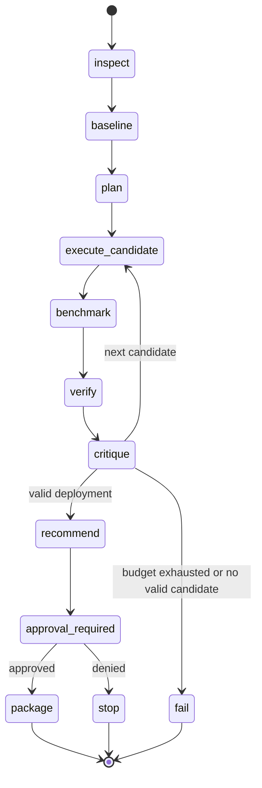
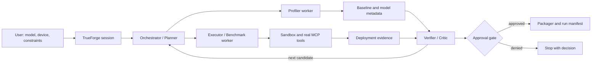

# EdgeOpt Architecture v0

## Scope

EdgeOpt v0 is a bounded, agentic model-to-edge deployment workflow. It accepts
a model reference, a target device profile, and explicit deployment
constraints. It inspects the model, establishes a baseline, selects from a
small declared candidate set, executes real tools in a sandbox, benchmarks and
verifies each result, critiques measured trade-offs, and stops at a human
approval gate before packaging.

## Product philosophy

EdgeOpt is an agentic, hardware-aware model-to-edge deployment engineer:
understand before optimizing, measure instead of assume, optimize only as much
as the deployment contract requires, never let an LLM invent or override
measurements, and never package or deploy before explicit approval. TrueForge
owns orchestration; deterministic adapters and typed tools own inspection,
conversion, execution, benchmarking, verification, and packaging.

The full vision is `supported model + evaluation data + target profile + real
application context + user objectives → capability discovery → bounded adaptive
optimization → benchmarking → verifier/critic → approval → deployment
artifact`. The hackathon v0 deliberately implements only `ONNX CPU fixture →
baseline → one measured ONNX Runtime graph candidate → one incompatible
candidate rejected → evidence → verifier → approval-gated package`.

## DeploymentContract

The first-class input is a normalized `DeploymentContract` with five sections:

- **model:** source/reference, format/framework, task, artifact hash, and known
  input/output schemas.
- **evaluation:** fixture/dataset reference and hash, split semantics,
  preprocessing identity/hash, metric or synthetic-similarity definition, and
  future calibration/evaluation separation.
- **target:** device/profile ID, verified capabilities/runtime/provider, known
  CPU/GPU/memory, and a measured-vs-profiled source-of-truth marker.
- **application_context:** use case, sensor/input source, expected resolution
  or batch size, and known decode/preprocess/inference/postprocess constraints.
- **objectives:** explicit priority (`speed`, `quality`, `memory`, `balanced`,
  or `custom`) and hard constraints such as quality degradation, p95 latency,
  throughput, memory, and artifact size.

An unspecified priority may resolve to a documented default, but the resolved
policy is visible. The contract is generic enough for a future road-camera /
Jetson profile while the v0 demo uses only a synthetic CPU context.

## Adapter and optimization boundaries

ONNX is the canonical v0 interchange format, not a rule that every future model
must first convert to ONNX. A small adapter/registry boundary leaves room for
`onnx_export`, `onnxruntime_graph_optimization`,
`nvidia_modelopt_ptq`, `nvidia_modelopt_pruning_or_sparsity`,
`tensorrt_build`, and `openvino_compile`. Only the ONNX Runtime CPU adapter is
implemented now; future adapters are capability-gated and must not add their
heavy dependencies until verified.

The cost-aware ladder is: 0 baseline, 1 runtime/graph optimization, 2 post-
training quantization, 3 precision/resolution/runtime alternatives, 4
pruning/sparsity, and 5 QAT/fine-tuning/distillation. v0 implements levels 0/1
and a deterministic capability rejection; it does not train or search
unboundedly.

## Connected target versus profile

A connected/measured target may report performance as measured on that target.
A static or snapshot profile can establish compatibility from declared or
verified capabilities, but its performance must never be presented as hardware
measurement. The CPU v0 evidence is local ONNX Runtime measurement on the
`local-cpu-onnxruntime` profile; it makes no Jetson, DGX Spark, CUDA, TensorRT,
or Model Optimizer claim.

The first green path is CPU-first ONNX Runtime. NVIDIA Model Optimizer,
TensorRT, OpenVINO, and research fixtures are optional adapters and must be
capability-checked before use.

## Non-goals

- No new pruning, quantization, Bayesian optimization, or agent algorithm.
- No broad AutoML platform, multi-domain benchmark, or thesis-grade novelty
  claim.
- No training server, unrestricted hyperparameter sweep, or unbounded agent
  loop.
- No private datasets, private model weights, credentials, or runtime reliance
  on Drive.
- No device flashing or irreversible deployment action without approval.

## Components

- **TrueForge session:** visible session, sandbox, persistence, and user-facing
  execution trace.
- **Orchestrator/Planner:** translates constraints into a bounded candidate
  plan and chooses the next declared action; it does not invent measurements.
- **Profiler worker:** inspects model schema, operators, parameters, input
  shapes, baseline correctness, and resource observations.
- **Executor/Benchmark worker:** invokes the selected optimizer/exporter and
  runtime, then measures with an explicit protocol.
- **Verifier/Critic:** checks compatibility and correctness, compares evidence
  with baseline, classifies failure or improvement, and explains the next
  decision from measurements.
- **Approval Gate:** explicit pause requiring human approval before packaging.
- **Packager:** creates the selected deployment bundle and manifest only after
  approval.

## Boundaries

### MCP boundary

EdgeOpt exposes or consumes real, typed MCP tools for profiling, transformation,
execution, benchmarking, and evidence retrieval. Tool calls include validated
schemas, candidate IDs, target profile, and bounded resource/time limits.
Prose-only or simulated tool output is not deployment evidence.

### Sandbox boundary

All candidate code execution occurs in the persistent TrueForge sandbox. The
sandbox is scoped to declared inputs and a temporary output area. It must not
receive credentials or modify the host, repository history, system services,
or external coordination stores.

## Data abstractions

### Model input

```yaml
model:
  id: string
  format: onnx | pytorch | other
  uri: local-or-declared-reference
  sha256: string
  input_schema: [{name: string, shape: [int|string], dtype: string}]
  output_schema: [{name: string, shape: [int|string], dtype: string}]
  task: classification | detection | segmentation | other
```

### Evaluation specification

Every baseline/candidate correctness comparison uses one immutable evaluation
specification. The baseline and all candidates in one v0 comparison must carry
the same `evaluation_id`; starting a new comparison is outside v0 scope.

```yaml
evaluation:
  evaluation_id: string
  fixture_ref: public-or-local-declared-reference
  fixture_sha256: string
  ground_truth_ref: public-or-local-declared-reference|null
  ground_truth_sha256: string|null
  split_or_subset: string
  preprocessing:
    spec_version: string
    canonical_spec_sha256: string
  sample_count: int|null
  task: string
  metric_id: string
```

The fixture, labels/ground truth when separate, split, preprocessing
specification, and their hashes are part of the run manifest. A local fixture
is allowed for the reproducible demo, but it must be declared and must not be
an undeclared private runtime dependency.

### Device profile

```yaml
device:
  id: string
  cpu: string
  gpu: string|null
  memory_mb: int|null
  provider: cpu | cuda | tensorrt | openvino | other
  runtime: string
  capabilities: [string]
  verified_at: string
```

The profile describes verified capabilities, not desired capabilities. Device-
gated adapters must fail clearly when the profile is not approved or compatible.

### Constraints

```yaml
constraints:
  quality_request:
    metric_id: string
    metric_name: string
    direction: higher_is_better | lower_is_better
    drop_mode: absolute | relative
    allowed_degradation: number
  max_p95_latency_ms: number|null
  max_memory_mb: number|null
  min_throughput: number|null
  max_model_size_mb: number|null
  evaluation_budget: int
```

`quality_request` is the user's input only. After the baseline is measured, the
run resolves one immutable quality rule. The resolved rule, rather than a
candidate-supplied copy of these fields, is the sole authority for comparison.

### Resolved quality rule

```yaml
quality_rule:
  quality_rule_id: string
  version: string
  sha256: string
  evaluation_id: string
  metric_id: string
  direction: higher_is_better | lower_is_better
  drop_mode: absolute | relative
  allowed_degradation: number
  baseline_evidence_id: string
  baseline_evidence_sha256: string
  baseline_value: number
```

The resolver copies the metric identity/direction/mode/threshold from the
declared request, binds them to the baseline evidence produced under the same
`evaluation_id`, canonicalizes the object, and records its ID, version, and
hash. The rule is frozen before the first candidate comparison. A baseline
record has an `evidence_id`, `evaluation_id`, `metric_id`, measured `value`,
and artifact/input provenance; it is the only source of `baseline_value`.
Candidate evidence cannot supply or replace the baseline, threshold, direction,
or metric identity.

### Candidate configuration

```yaml
candidate:
  id: string
  parent_artifact_sha256: string
  transformations: [{kind: string, parameters: object}]
  provider: string
  runtime_options: object
  seed: int
  status: planned | running | rejected | measured | recommended | failed
```

### Baseline and candidate deployment evidence

```yaml
baseline_evidence:
  evidence_id: string
  evaluation_id: string
  metric_id: string
  value: number
  artifact_sha256: string
  measured_at: string

candidate_evidence:
  evidence_id: string
  candidate_id: string
  evaluation_id: string
  quality_rule_id: string
  quality_rule_version: string
  quality_rule_sha256: string
  baseline_evidence_id: string
  baseline_evidence_sha256: string
  correctness:
    metric_id: string # derived from evaluation.metric_id and quality_rule
    direction: higher_is_better | lower_is_better # derived from quality_rule
    drop_mode: absolute | relative # derived from quality_rule
    baseline_value: number # derived from the referenced baseline evidence
    candidate_value: number
    allowed_degradation: number # derived from quality_rule
    computed_degradation: number # verifier-computed
    passed: bool # verifier-computed; not an independent assertion
  latency_ms: {p50: number, p95: number, unit: string}
  throughput: number|null
  peak_memory_mb: number|null
  model_size_mb: number|null
  provider: string
  warmup: int
  repeats: int
  device_profile_id: string
  measured_at: string
  artifact_sha256: string
```

The initial baseline evidence is produced under the evaluation specification
and records its own identity/hash before the quality rule is frozen. The
resolver then uses that baseline record to create the quality rule. Every
candidate evidence record references the baseline identity and the frozen
quality-rule ID/version/hash. Repeated metric, direction, mode, threshold, and
baseline fields in `candidate_evidence` are derived audit output only: the
verifier MUST assert that they equal the referenced evaluation specification,
frozen quality rule, and baseline evidence, and MUST fail closed on any
mismatch. The verifier also MUST fail closed when evaluation IDs, rule hashes,
baseline hashes, or required values are missing, stale, non-finite, or
inconsistent. No candidate/evidence field can independently configure the
comparison.

`correctness.passed` is mechanically derived from the frozen quality rule and
the referenced baseline/candidate values. After all bindings pass, compute raw
degradation in metric units:

```text
higher_is_better: raw = max(0, baseline_value - candidate_value)
lower_is_better:  raw = max(0, candidate_value - baseline_value)
```

For `drop_mode: absolute`, `computed_degradation = raw`. For
`drop_mode: relative`, `computed_degradation = raw / abs(baseline_value)` and
the comparison fails when `baseline_value` is zero, missing, non-finite, or
otherwise lacks a valid denominator. The candidate passes quality when
`computed_degradation <= allowed_degradation`; missing/non-finite values fail.
An improvement is clamped to zero degradation. The evidence must retain the
direction, mode, baseline, candidate, allowed threshold, and computed result so
the verifier can audit the decision without trusting a prose explanation.

### Provenance/run manifest

The manifest binds task/run ID, Git commit and dirty state, resolved
configuration, parent and candidate hashes, tool/runtime versions, target
profile, seed, the complete immutable evaluation specification, benchmark
protocol, the frozen quality rule, baseline evidence identity/hash, candidate
evidence identity/hash, critic decision, and approval state. It must distinguish
measured fields from assumptions and failures. Baseline and every candidate
evidence record reference the same `evaluation_id` and resolved quality-rule
binding for a v0 comparison.

## State machine



Unsupported operators, providers, shapes, precisions, missing artifacts, and
constraint violations are explicit rejection/failure outcomes. They must not
silently fall through as successes.

## System view



## Persistence and resume

The TrueForge session and project run record preserve candidate history,
evidence, critique, budget, and approval state. A resumed session must reload
the manifest and avoid repeating a completed candidate unless explicitly
requested. The minimal implementation may use a project-local JSON/SQLite
record, provided it contains no credentials or large artifacts.

## Optional adapters

- **NVIDIA Model Optimizer/TensorRT:** optional, pending verified package,
  runtime, and named compatible device. Never assume laptop availability.
- **OpenVINO:** optional CPU path after the ONNX green path is stable.
- **Research fixtures:** optional external validation inputs; they do not become
  current hackathon source code or private runtime dependencies.
