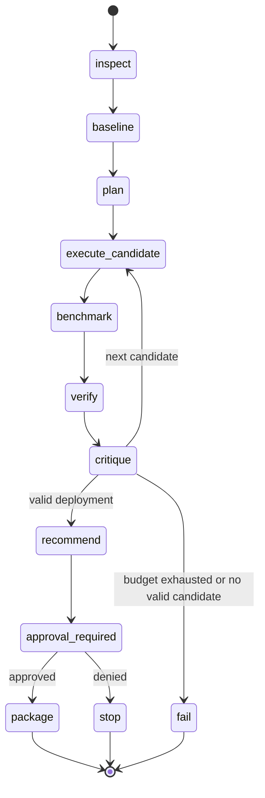
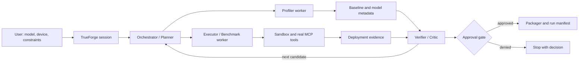

# EdgeOpt Architecture v0

## Scope

EdgeOpt v0 is a bounded, agentic model-to-edge deployment workflow. It accepts
a model reference, a target device profile, and explicit deployment
constraints. It inspects the model, establishes a baseline, selects from a
small declared candidate set, executes real tools in a sandbox, benchmarks and
verifies each result, critiques measured trade-offs, and stops at a human
approval gate before packaging.

The first green path is CPU-first ONNX Runtime. NVIDIA Model Optimizer,
TensorRT, OpenVINO, and research fixtures are optional adapters and must be
capability-checked before use.

## Non-goals

- No new pruning, quantization, Bayesian optimization, or agent algorithm.
- No broad AutoML platform, multi-domain benchmark, or thesis-grade novelty
  claim.
- No training server, unrestricted hyperparameter sweep, or unbounded agent
  loop.
- No private datasets, private model weights, credentials, or runtime reliance
  on Drive.
- No device flashing or irreversible deployment action without approval.

## Components

- **TrueForge session:** visible session, sandbox, persistence, and user-facing
  execution trace.
- **Orchestrator/Planner:** translates constraints into a bounded candidate
  plan and chooses the next declared action; it does not invent measurements.
- **Profiler worker:** inspects model schema, operators, parameters, input
  shapes, baseline correctness, and resource observations.
- **Executor/Benchmark worker:** invokes the selected optimizer/exporter and
  runtime, then measures with an explicit protocol.
- **Verifier/Critic:** checks compatibility and correctness, compares evidence
  with baseline, classifies failure or improvement, and explains the next
  decision from measurements.
- **Approval Gate:** explicit pause requiring human approval before packaging.
- **Packager:** creates the selected deployment bundle and manifest only after
  approval.

## Boundaries

### MCP boundary

EdgeOpt exposes or consumes real, typed MCP tools for profiling, transformation,
execution, benchmarking, and evidence retrieval. Tool calls include validated
schemas, candidate IDs, target profile, and bounded resource/time limits.
Prose-only or simulated tool output is not deployment evidence.

### Sandbox boundary

All candidate code execution occurs in the persistent TrueForge sandbox. The
sandbox is scoped to declared inputs and a temporary output area. It must not
receive credentials or modify the host, repository history, system services,
or external coordination stores.

## Data abstractions

### Model input

```yaml
model:
  id: string
  format: onnx | pytorch | other
  uri: local-or-declared-reference
  sha256: string
  input_schema: [{name: string, shape: [int|string], dtype: string}]
  output_schema: [{name: string, shape: [int|string], dtype: string}]
  task: classification | detection | segmentation | other
```

### Device profile

```yaml
device:
  id: string
  cpu: string
  gpu: string|null
  memory_mb: int|null
  provider: cpu | cuda | tensorrt | openvino | other
  runtime: string
  capabilities: [string]
  verified_at: string
```

The profile describes verified capabilities, not desired capabilities. Device-
gated adapters must fail clearly when the profile is not approved or compatible.

### Constraints

```yaml
constraints:
  quality_metric: string
  max_quality_drop: number|null
  max_p95_latency_ms: number|null
  max_memory_mb: number|null
  min_throughput: number|null
  max_model_size_mb: number|null
  evaluation_budget: int
```

### Candidate configuration

```yaml
candidate:
  id: string
  parent_artifact_sha256: string
  transformations: [{kind: string, parameters: object}]
  provider: string
  runtime_options: object
  seed: int
  status: planned | running | rejected | measured | recommended | failed
```

### Deployment evidence

```yaml
evidence:
  candidate_id: string
  correctness: {metric: number, tolerance: number, passed: bool}
  latency_ms: {p50: number, p95: number, unit: string}
  throughput: number|null
  peak_memory_mb: number|null
  model_size_mb: number|null
  provider: string
  warmup: int
  repeats: int
  device_profile_id: string
  measured_at: string
  artifact_sha256: string
```

### Provenance/run manifest

The manifest binds task/run ID, Git commit and dirty state, resolved
configuration, parent and candidate hashes, tool/runtime versions, target
profile, seed, benchmark protocol, evidence, critic decision, and approval
state. It must distinguish measured fields from assumptions and failures.

## State machine



Unsupported operators, providers, shapes, precisions, missing artifacts, and
constraint violations are explicit rejection/failure outcomes. They must not
silently fall through as successes.

## System view



## Persistence and resume

The TrueForge session and project run record preserve candidate history,
evidence, critique, budget, and approval state. A resumed session must reload
the manifest and avoid repeating a completed candidate unless explicitly
requested. The minimal implementation may use a project-local JSON/SQLite
record, provided it contains no credentials or large artifacts.

## Optional adapters

- **NVIDIA Model Optimizer/TensorRT:** optional, pending verified package,
  runtime, and named compatible device. Never assume laptop availability.
- **OpenVINO:** optional CPU path after the ONNX green path is stable.
- **Research fixtures:** optional external validation inputs; they do not become
  current hackathon source code or private runtime dependencies.
